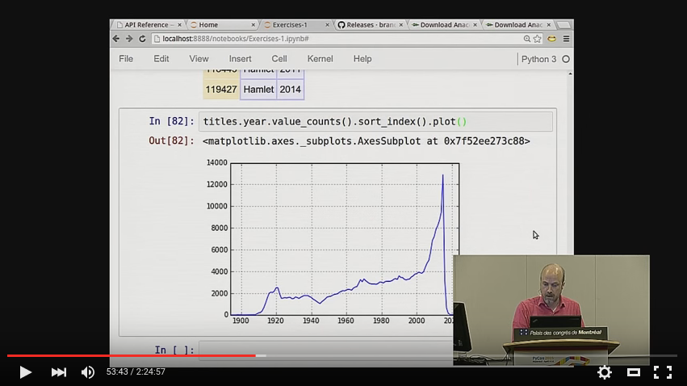

# for_anil

## Python Resources

- https://www.programiz.com/

## Jupyter Notebook

- https://www.dataquest.io/blog/jupyter-notebook-tutorial/

## Pandas Tutorial

If you want to follow along with the tutorial at home, here is the
YouTube recording of the 3-hour tutorial at PyCon itself:

Original Brandon Rhodes's github can be found at

- https://github.com/brandon-rhodes/pycon-pandas-tutorial

## Quick Start

If you have both `conda` and `git` on your system :

    $ conda install --yes jupyter matplotlib pandas
    $ git clone https://github.com/polymath-raval/for_anil
    $ cd for_anil

Download the the below data files in 'for_anil/data'

- ftp://ftp.fu-berlin.de/misc/movies/database/frozendata/actors.list.gz
- ftp://ftp.fu-berlin.de/misc/movies/database/frozendata/actresses.list.gz
- ftp://ftp.fu-berlin.de/misc/movies/database/frozendata/genres.list.gz
- ftp://ftp.fu-berlin.de/misc/movies/database/frozendata/release-dates.list.gz
 
OR

- ftp://ftp.funet.fi/pub/mirrors/ftp.imdb.com/pub/frozendata/actors.list.gz
- ftp://ftp.funet.fi/pub/mirrors/ftp.imdb.com/pub/frozendata/actresses.list.gz
- ftp://ftp.funet.fi/pub/mirrors/ftp.imdb.com/pub/frozendata/genres.list.gz
- ftp://ftp.funet.fi/pub/mirrors/ftp.imdb.com/pub/frozendata/release-dates.list.gz

### Project setup

To convert these into the CSV files that the tutorial needs, run the
`BUILD.py` script with either Python 2 or Python 3.  It will create the
three CSV files in the `data` directory that you need to run all of the
tutorial examples.  It should take about 5 minutes to run on a fast
modern machine:

$ python build/BUILD.py

** This repo is completely inspired from Brandon Rhodes's presentation of PyCON
